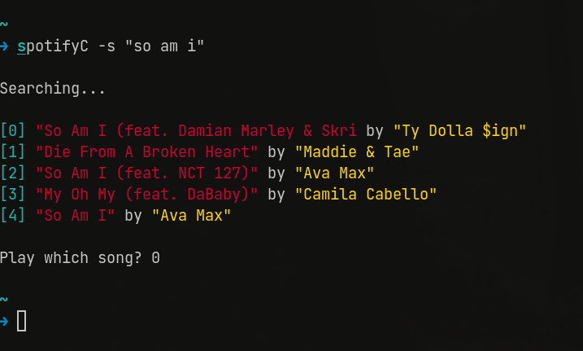

# SCpotify

### Minimal wrapper in C for the spotify client. 

I wrote this because I use the web client, while I can simply  
switch to the site and use my vim keybindings to change songs  
and such, I decided I also wanted a way to show what song  
was playing in my polybar.  

The spotify API is easy to work with but there are some issues,  
the biggest one is the OAUTH, in order to get it to work,  
I wrote a small script with `cronie` as the daemon for the cronjob.  

you need to follow the guide [here](https://developer.spotify.com/documentation/general/guides/authorization-guide/) to setup your refresh token.

#### sample commands
`spotifyC -n`  
Will play the next song  

`spotifyC -b`  
Will play the previous song  

`spotifyC -p`  
Will pause the song  

`spotifyC -r`  
Will reseume the song  
  
`spotifyC -s "example song"`  
Will search and prompt  

## TODO

### General
- [ ] add error checking  
- [X] add colors

### Player
- [X] shuffle functionality
- [X] repeat functionality
- [X] seek functionality (in ms for now)
- [X] volume functionality
- [ ] previously played functionality
- [ ] add song to current player

### Personalization
- [ ] display top artists and songs

### Artists
- [ ] display related artists 

### Browse  
- [ ] recommendations

### Albums
- [ ] search album and play song

### Optional  
[ ] use make for some of the automation
[ ] have the program handle OAUTH
