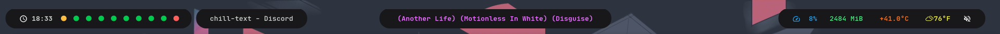

# SCpotify

### Minimal wrapper in C for the spotify client. 

I wrote this because I use the web client, while I can simply  
switch to the site and use my vim keybindings to change songs  
and such, I decided I also wanted a way to show what song  
was playing in my polybar.  

As of now, I have automatic token refresh albeit a bit wonky.  
I have a config file and when a request is not a 200, then the token  
get refreshed. I will be posting a guide here to to setup refresh tokens  
as well as register an app if you havent done so before.  

`mkdir ~/.config/scpotify`  
`touch ~/.config/scpotify/config.ini`

This is what I have in the file. 
I will add auto creation later.

```
CLIENT_SECRET=ZmU...zc=
REFRESH_TOKEN=AQ...M
token_placeholder
```

after the program is ran the first time, it will hold the 300 character token.




you need to follow the guide [here](https://developer.spotify.com/documentation/general/guides/authorization-guide/) to setup your refresh token.

#### sample commands
`spotifyC --show`  
Will display currently playing song  

`spotifyC -n`  
Will play the next song  

`spotifyC -b`  
Will play the previous song  

`spotifyC -p`  
Will pause the song  

`spotifyC -r`  
Will reseume the song  
  
`spotifyC -s "example song"`  
Will search and prompt  

`spotifyC -t`  
Will display past 20 songs  

`spotifyC -q "example song"`  
Will seach and prompt what song to add in queue  

`spotifyC --plist`  
Will prompt all your saved playlists and will then  
ask you which one you would like, to listen from.  
you will then be asked what song you want to play.  


## TODO

### General
- [ ] add error checking  
- [X] reduce redundant code
- [X] add colors

### Player
- [X] shuffle functionality
- [X] repeat functionality
- [X] seek functionality (in ms for now)
- [X] volume functionality
- [X] previously played functionality
- [X] add song to current player  
- [ ] get current context and prompt to play song from it

### Personalization
- [X] display top artists and songs

### Artists
- [X] display related artists 
- [ ] display artists and play song

### Albums
- [ ] search album and play song

### Podcasts  
- [ ] search and play podcast episodes  

### Playlists  
- [ ] look for specific playlists and add(follow) them to own library
- [ ] remove unwanted playlists  
- [ ] be able to add current playing song to playlist  

### OAUTH  
- [X] have the program handle OAUTH.
