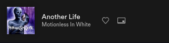

# SCpotify

### Minimal wrapper in C for the spotify client. 

I wrote this because I use the web client, while I can simply  
switch to the site and use my vim keybindings to change songs  
and such, I decided I also wanted a way to show what song  
was playing in my polybar.  

The spotify API is easy to work with but there are some issues,  
the biggest one is the OAUTH, in order to get it to work,  
I wrote a small script with `cronie` as the daemon for the cronjob.  

while I originally opted to have spotifyC handle the token renewal,  
I soon realized there was no feasible way to do this as spotifyC  
has a short life cycle, meaning the program's memory for the OAUTH  
token will still remain after getting the new one. If I were  
to get a new token for every invocation, you would have 86400+ requests  
in a single day. It's just bettter to have refresh.sh being run by  
a cronjob every 45 minutes a day, which is a lot less in the long run.  
I will try to find a way as I am sure apps like spotifyd or spt don't run  
into this problem.  

you need to follow the guide [here](https://developer.spotify.com/documentation/general/guides/authorization-guide/) to setup your refresh token.

#### sample commands
`spotifyC --show`  
Will display currently playing song  

`spotifyC -n`  
Will play the next song  

`spotifyC -b`  
Will play the previous song  

`spotifyC -p`  
Will pause the song  

`spotifyC -r`  
Will reseume the song  
  
`spotifyC -s "example song"`  
Will search and prompt  

`spotifyC -t`  
Will display past 20 songs  

`spotifyC -q "example song"`  
Will seach and prompt what song to add in queue  

## TODO

### General
- [ ] add error checking  
- [X] reduce redundant code
- [X] add colors

### Player
- [X] shuffle functionality
- [X] repeat functionality
- [X] seek functionality (in ms for now)
- [X] volume functionality
- [X] previously played functionality
- [X] add song to current player

### Personalization
- [ ] display top artists and songs

### Artists
- [ ] display related artists 
- [ ] display artists and play song

### Albums
- [ ] search album and play song

### Optional  
- [ ] have the program handle OAUTH
